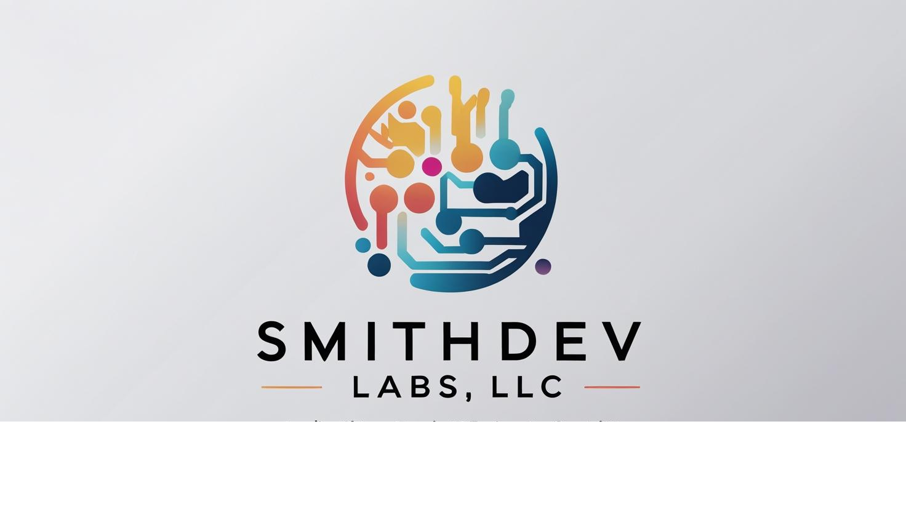

# SmithDev Labs — AI Solutions Agency Website



> **AI-Powered Growth for Your Business** — Professional agency website for SmithDev Labs LLC, offering generative AI, intelligent chatbots, business automation, and custom websites for small and medium businesses.

---

## Live Site

🌐 **[smithdevlabs.com](github.com/MSMITH71910/smithdevlabs_prosite)**

---

## Overview

This is the official marketing website for **SmithDev Labs LLC** — a full-service AI solutions agency. The site is built with clean, fast, dependency-free HTML/CSS/JavaScript and is deployed on Netlify with automatic form handling.

---

## Pages

| Page | Description |
|------|-------------|
| `index.html` | Home — hero section, live AI chat demo, services overview, stats, CTA |
| `services.html` | Detailed breakdown of all four service offerings |
| `pricing.html` | Project packages, monthly retainer tiers, and add-ons |
| `about.html` | Company story, mission, values, and differentiators |
| `contact.html` | Lead capture form (Netlify), free AI audit booking, contact info |

---

## Services Offered

- **Business Websites** — Fast, mobile-first sites built to convert visitors into leads
- **AI Chatbots** — 24/7 intelligent assistants that qualify leads and answer questions
- **Business Automation** — Workflow automation using Make.com, n8n, and Zapier
- **AI Agents** — Custom AI agents powered by OpenAI, Relevance AI, and Voiceflow

---

## Tech Stack

| Layer | Technology |
|-------|------------|
| Frontend | HTML5, CSS3, Vanilla JavaScript |
| Forms | Netlify Forms (no backend required) |
| Hosting | Netlify (Free Tier) |
| Domain | Google Workspace / Google Domains |
| Version Control | GitHub |
| Fonts | System font stack (zero external dependencies) |

---

## Project Structure

```
smithdevlabs_prosite/
├── index.html          # Home page
├── services.html       # Services page
├── pricing.html        # Pricing page
├── about.html          # About page
├── contact.html        # Contact / booking page
├── css/
│   └── style.css       # Full design system — variables, layout, components
├── js/
│   └── main.js         # Navbar scroll, mobile menu, animations, form handling
├── images/
│   └── logo.png        # SmithDev Labs LLC logo
└── netlify.toml        # Netlify redirect and build configuration
```

---

## Features

- **Fully Responsive** — Mobile-first design that works on all screen sizes
- **Zero Dependencies** — No frameworks, no npm, no build step required
- **Fast Load Times** — Optimized CSS and JS, no external library bloat
- **Netlify Forms** — Contact form submissions handled automatically, no backend needed
- **Scroll Animations** — Smooth fade-up reveals using IntersectionObserver
- **Live AI Chat Demo** — Animated chat widget on the home page showing a real client example
- **SEO Ready** — Meta descriptions and semantic HTML on every page

---

## Getting Started

### View Locally

```bash
git clone https://github.com/MSMITH71910/smithdevlabs_prosite.git
cd smithdevlabs_prosite
# Open index.html in your browser
open index.html
```

### Deploy to Netlify

1. Log in to [netlify.com](https://netlify.com)
2. Click **Add new site → Import an existing project**
3. Connect your GitHub account and select `MSMITH71910/smithdevlabs_prosite`
4. Set branch to `main`, leave build settings blank
5. Click **Deploy site**
6. Go to **Domain settings** and add `smithdevlabs.com`

---

## Contact Form Setup

The contact form uses **Netlify Forms** — it works automatically once the site is deployed to Netlify. No API keys or backend configuration needed.

Form submissions go to your **Netlify dashboard → Forms tab** and can be forwarded to any email address under **Site settings → Forms → Notifications**.

---

## Contact

**SmithDev Labs LLC**
📧 [msmith@smithdevlabs.com](mailto:msmith@smithdevlabs.com)
🌐 [smithdevlabs.com](https://smithdevlabs.com)
🐙 [github.com/MSMITH71910](https://github.com/MSMITH71910)

---

## License

© 2026 SmithDev Labs LLC. All rights reserved.
